<div align="center">

# Nebula Requiem

**A cosmic bullet-hell roguelike for Android, written in Kotlin.**

No network and no downloads: every pixel, sound effect and note of music is generated on the device by native code.


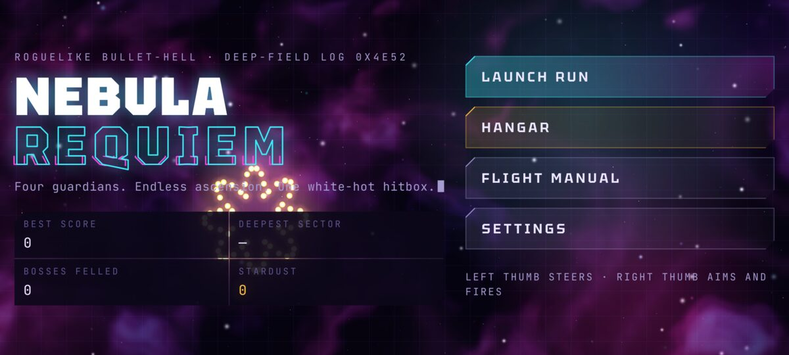

</div>

Thread a white-hot hitbox through mathematical bullet storms, graze shots to charge Overdrive, and draft synaptic grafts as you level. Fly the story, ten sectors and ten guardians to an ending, or go endless and see how deep you get, on Easy, Medium, Hard or Maniac. Stardust you bring home buys permanent refits and new hulls in the Hangar.

<table>
<tr>
<td width="50%">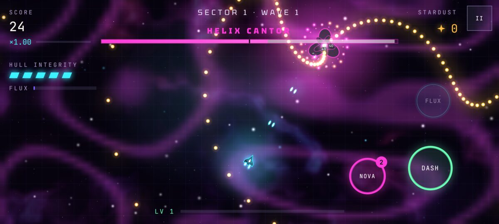<br><b>Helix Cantor</b>: rose curves, double helices and Cantor-set walls</td>
<td width="50%">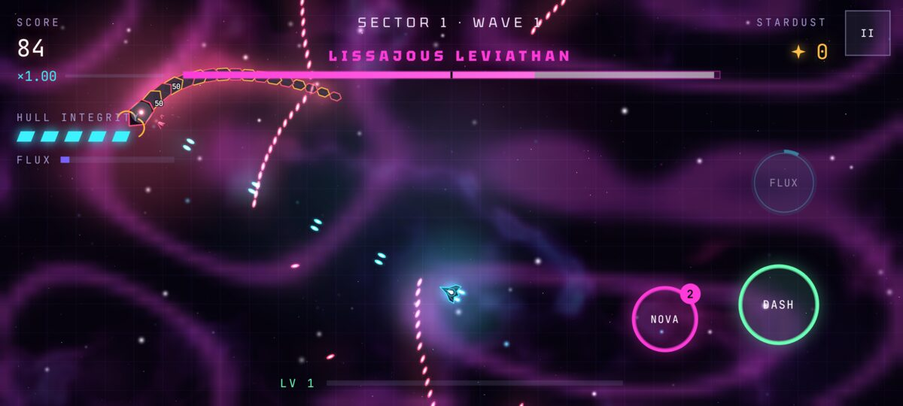<br><b>Lissajous Leviathan</b>: a follow-the-leader serpent on a Lissajous path</td>
</tr>
<tr>
<td>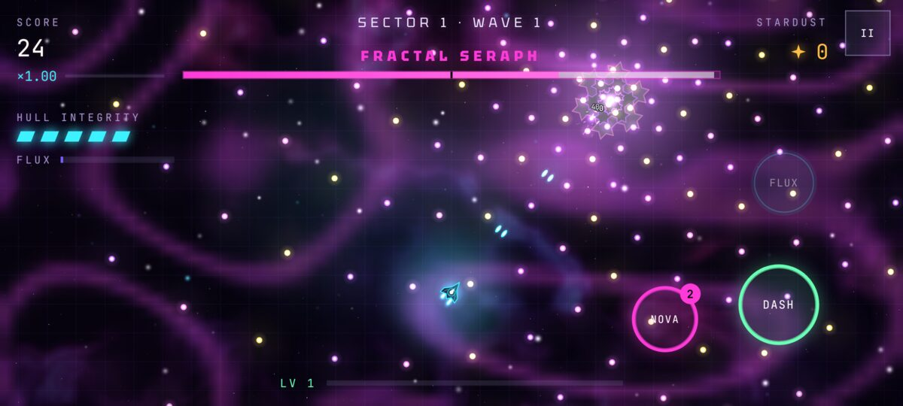<br><b>Fractal Seraph</b>: Koch snowflakes, phyllotaxis spirals and lances</td>
<td>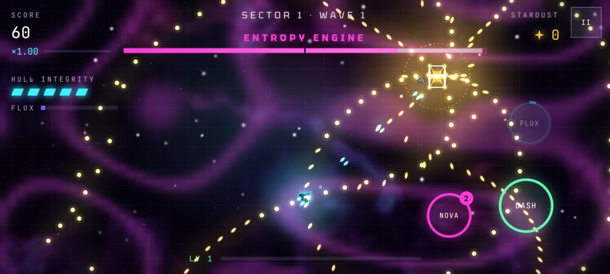<br><b>Entropy Engine</b>: a 4-D tesseract and Lorenz-attractor swarms</td>
</tr>
<tr>
<td>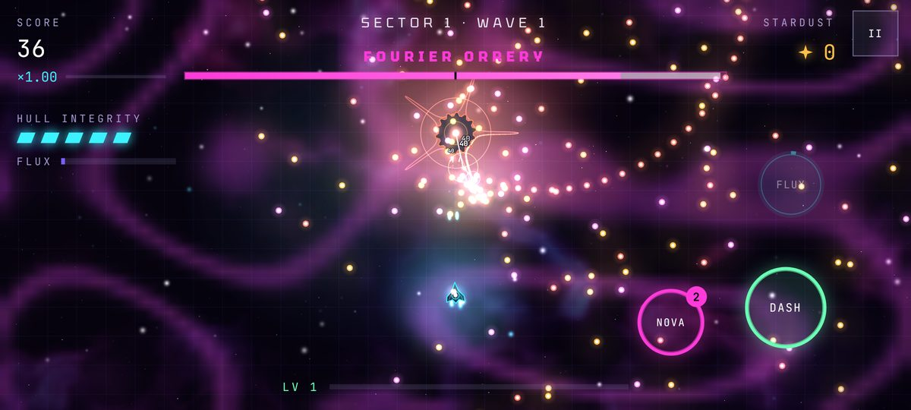<br><b>Fourier Orrery</b>: epicycles summing a Fourier series, phasor blooms and the Gibbs overshoot</td>
<td>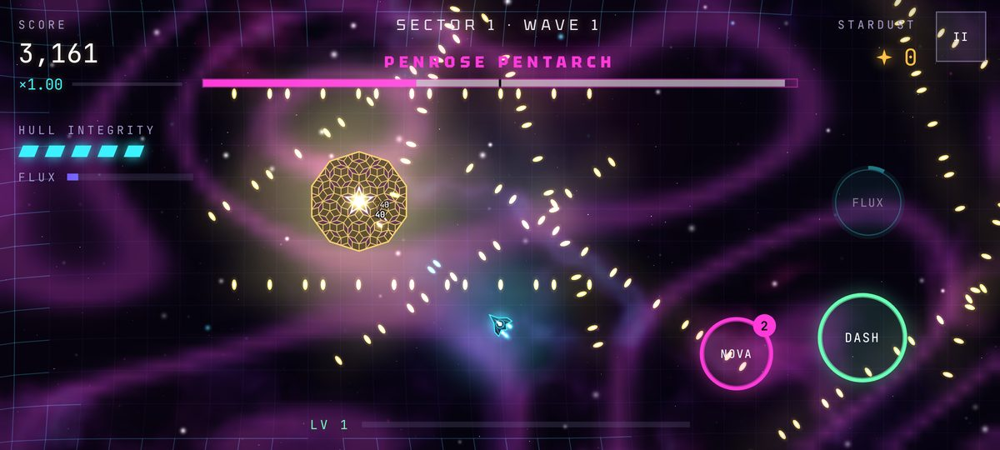<br><b>Penrose Pentarch</b>: a Penrose tiling that deflates, pentagrid walls with Fibonacci gaps</td>
</tr>
<tr>
<td>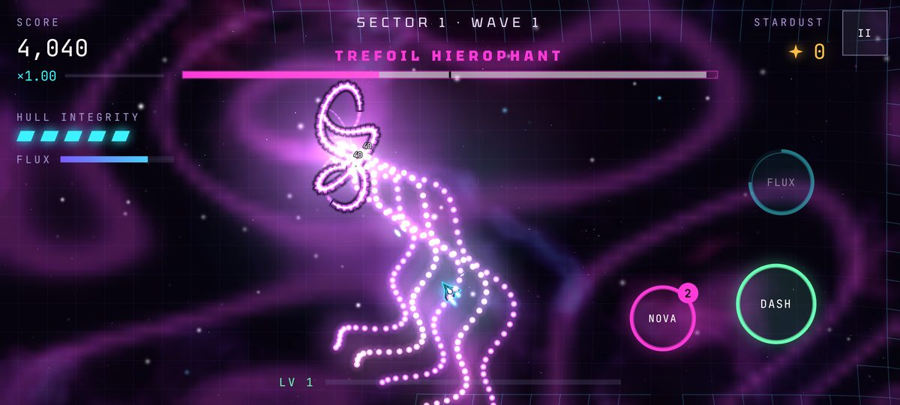<br><b>Trefoil Hierophant</b>: a torus knot turning in 3-D, braid words and writhing spirals</td>
<td>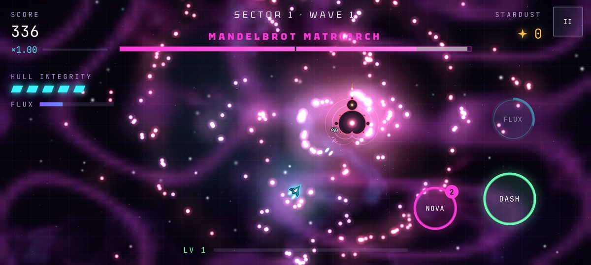<br><b>Mandelbrot Matriarch</b>: the cardioid and its bulbs, Julia gardens and seahorse spirals</td>
</tr>
<tr>
<td>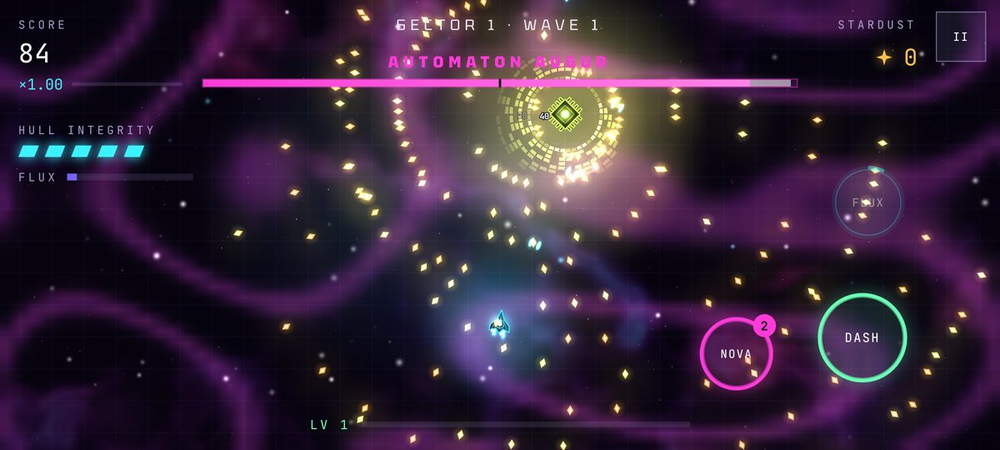<br><b>Automaton Augur</b>: Rule 30 and Rule 110 on a ring of cells, gliders and space-time rows</td>
<td>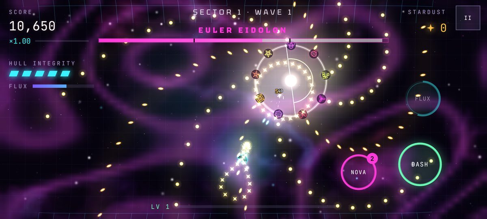<br><b>Euler Eidolon</b>: the unit circle, three phases and nine sigils quoting every guardian before it</td>
</tr>
<tr>
<td>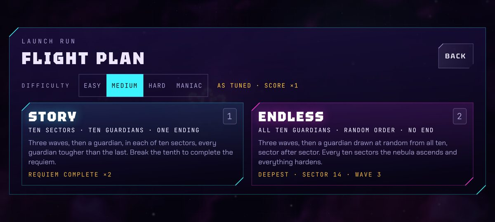<br><b>Flight plan</b>: the ten-sector story or endless, at four difficulties</td>
<td>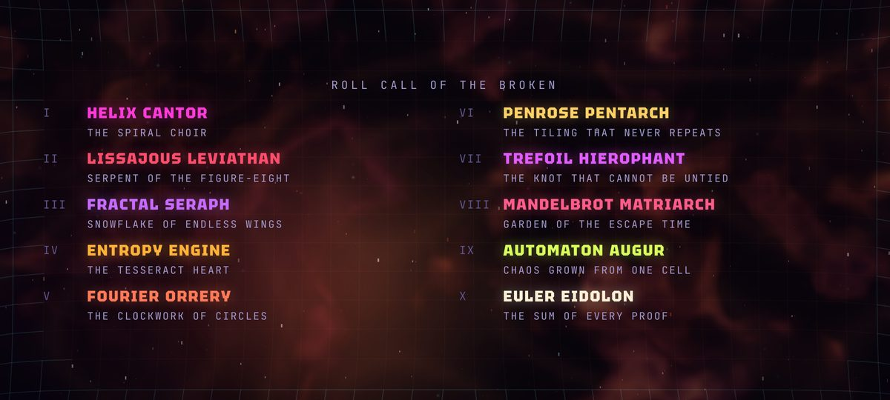<br><b>Requiem complete</b>: the story's ending and its roll call</td>
</tr>
<tr>
<td>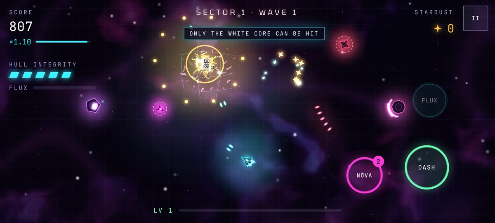<br><b>Hostiles</b>: the eight of the first two sectors</td>
<td>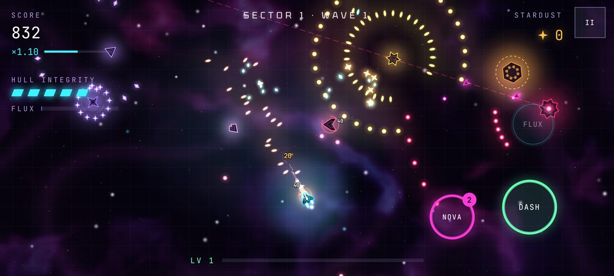<br><b>Eight more</b>: one joins after each guardian, sectors 3–10</td>
</tr>
<tr>
<td>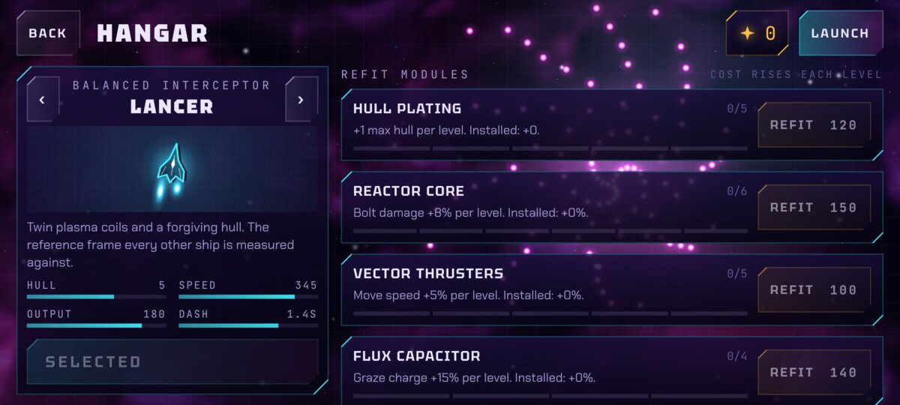<br><b>Hangar</b>: three hulls and eleven permanent refits</td>
<td>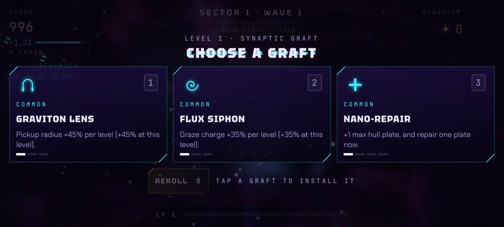<br><b>Graft draft</b>: twenty-four synaptic grafts</td>
</tr>
<tr>
<td>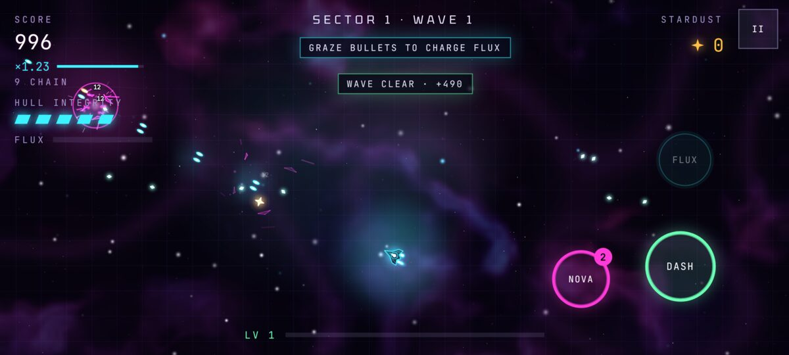<br><b>Touch HUD</b>: twin-stick thumbs and ability buttons</td>
<td>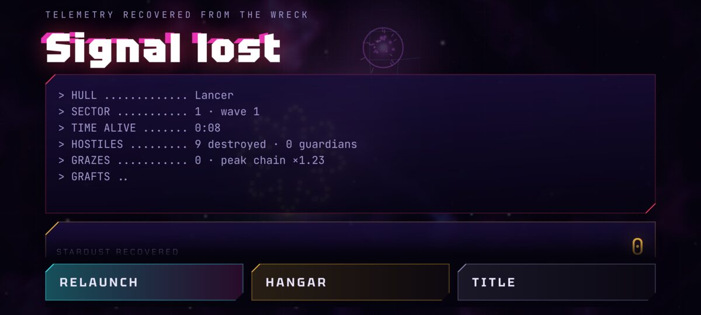<br><b>Signal lost</b>: the run's telemetry and stardust</td>
</tr>
<tr>
<td>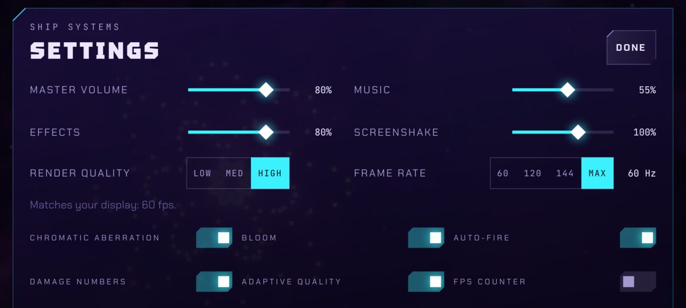<br><b>Settings</b>: audio, quality, frame rate and effects</td>
<td>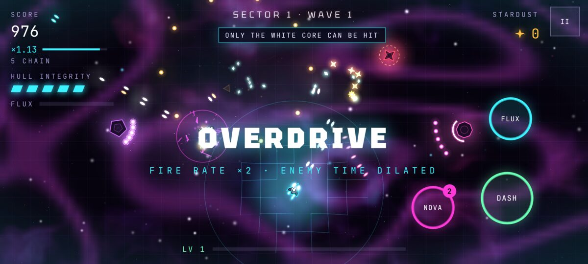<br><b>Overdrive</b>: doubled fire rate and dilated enemy time</td>
</tr>
</table>

*Screenshots are frames from the native renderer, captured by the project's own screenshot tests.*

## Download

Get version 0.4.2 from [`release/`](release/), or the latest build from [Actions](https://github.com/aloualou56/nebula_requiem/actions/workflows/build.yml): open the newest successful run and download `nebula-requiem-apk`. It needs Android 13 or newer. Open the APK on the device and allow the app you opened it from to install unknown apps.

If a copy of the game signed with a different key is already installed, uninstall it first; uninstalling deletes that copy's save.

## Contents

- [Download](#download)
- [Technology](#technology)
- [What's in the game](#whats-in-the-game)
- [Controls](#controls)
- [Build](#build)
- [Tests and checks](#tests-and-checks)
- [Architecture](#architecture)
- [Licenses](#licenses)

## Technology

The game runs entirely on Android's native APIs:

- **Rendering**: hardware-accelerated `Canvas` on a `SurfaceView`, sprite batches via `drawVertices`, `BlendMode.PLUS`
- **Post-processing**: a `RenderNode` + `RenderEffect` graph with AGSL `RuntimeShader`s (bloom: threshold → Gaussian blur → additive blend; radial RGB split)
- **UI**: a canvas UI toolkit (chamfered slabs, glitch titles, typewriter text, staggered entrances, responsive breakpoints) laid out in dp
- **Audio**: a software synthesizer on a low-latency `AudioTrack` thread: band-limited oscillators, biquad filters, envelopes, reverb, echo and a compressor
- **Game loop**: a dedicated game thread paced by `Choreographer` vsync
- **Saves**: versioned JSON in `files/saves/`, written atomically with `AtomicFile`, plus a backup copy
- **Fonts**: Tektur, Chakra Petch and JetBrains Mono bundled as TTF resources

The APK loads no remote assets, and the manifest requests no `INTERNET` permission (only `VIBRATE`, for haptics).

## What's in the game

- **Screens**: title (with attract-mode bullet patterns), Launch Run with its flight plan, Hangar, Flight Manual, Settings, HUD, pause, graft draft, warp and boss banners, toasts, game over with its typewriter telemetry log and stardust count-up, and the ending: a victory pause and warp out, an epilogue, a roll call of the ten guardians and the run's telemetry. Landscape layouts for phones (down to 640 × 360 dp), foldables and tablets.
- **Hulls**: Lancer, Wraith and Bastion, with their stats, engines and preview.
- **Hostiles**: Mote, Gyre, Dart, Weaver, Mitosis (divides twice), Seer, Sower (mines) and Aegis (frontal shield), plus elite variants; and eight more, one debuting in the first wave of each sector from 3 to 10, right after a guardian: Prism (shards that stop, then re-aim), Comet (sights a line, streaks along it and leaves a wake), Pulsar (charged rings with one gap), Hive (launches drones), Vortex (winds a ring of shards, then flings it), Phantom (blinks out and reappears beside you), Carom (shots that bank off the walls) and Harbinger (a sweeping beam).
- **Guardians**: one for each of the story's ten sectors: Helix Cantor, Lissajous Leviathan, Fractal Seraph, Entropy Engine, Fourier Orrery, Penrose Pentarch, Trefoil Hierophant, Mandelbrot Matriarch, Automaton Augur and Euler Eidolon. Each is a piece of mathematics with its own movement, look and attack phases, and each sector's guardian is tougher and faster than the last.
- **Difficulty**: Easy, Medium (the game as tuned), Hard and Maniac, chosen on the flight plan. They scale hostile HP, numbers, fire rate and bullet speed, guardians' HP and attack speed, and the score (so the stardust) a run earns: from 0.75× on Easy to 1.7× on Maniac.
- **Progression**: two flight plans, both three waves and a guardian a sector: the story, ten sectors won by breaking the tenth guardian, and endless, which deals the ten guardians in a shuffled order and ascends every ten sectors. The wave director and formations, the six sector mutators (Hyperflux, Swarm Tide, Volatile Hulls, Elite Surge, Eclipse, Overclocked Foes), XP and levels, 24 grafts with rarities and rerolls, 11 hangar refits with geometric costs, stardust, score, combo chain and multiplier, records.
- **Systems**: grazing and flux, Overdrive (time dilation), phase dash, nova bombs, missiles, orbitals, lasers, homing, splitting, bouncing and Lorenz-attractor bullets, pickups and magnets, hit-stop and slow motion.
- **Visuals**: procedural nebulae, plasma field, parallax stars, lighting grid, spacetime lattice with gravity wells, glows and additive blending, bloom, chromatic aberration and glitch shifts, explosions, shockwaves, sparks, embers, smoke, lightning, afterimages, screen shake, vignette, hurt and Overdrive washes, film grain and scanlines (keyboard play).
- **Audio**: every sound effect recipe and the adaptive score (menu, combat, guardian and game-over modes with pad, arpeggio and echo, bass, drums and lead layers), master/music/effects volume, and a bass meter that makes the visuals pulse with the music.
- **Settings**: volumes, screenshake, render quality, frame-rate cap (60/120/144/max), chromatic aberration, bloom, auto-fire, damage numbers, adaptive quality, FPS counter, vibration, erase save.

## Controls

| Action | Touch | Keyboard / mouse | Gamepad |
| --- | --- | --- | --- |
| Move | Left thumb (floating stick) | WASD / arrow keys | Left stick, D-pad |
| Aim | Right thumb | Mouse | Right stick |
| Fire | Right thumb (auto-fire is on by default) | Hold left click / J | R2 |
| Phase dash | Dash button | Space / Shift / right click | A |
| Nova bomb | Nova button | E / K | B |
| Overdrive | Flux button (when the meter is full) | Q / L | X |
| Pause | II button, or system Back | Esc / P | Start |
| Menus | Tap | Arrows/Tab to focus, Enter to confirm, Esc to go back; H hangar, M manual, O settings, R resume run; 1 / 2 pick a flight plan, D steps its difficulty | D-pad or left stick to focus, A to confirm, B to go back |
| Graft draft | Tap a card | 1 / 2 / 3, R to reroll | Focus a card, A |

System Back: during a run it pauses (and resumes from pause); in Settings, the manual, the flight plan or the Hangar it goes back; on the game-over screen and the ending it returns to the title; on the title screen it sends the app to the background.

## Build

Requirements:

- JDK 17 or newer (built and tested with JDK 21)
- Android SDK with platform `android-36` and build-tools `36.0.0` (point `sdk.dir` in `local.properties` at it, or set `ANDROID_HOME`)

The Gradle wrapper (8.14) fetches everything else.

```sh
./gradlew assembleRelease      # → app/build/outputs/apk/release/app-release.apk
./gradlew assembleDebug        # → app/build/outputs/apk/debug/app-debug.apk (package suffix .debug)
```

The release APK is minified and resource-shrunk (about 600 KB). To sign it with your own key, copy `keystore.properties.example` to `keystore.properties` and fill it in; without that file the release build is signed with the debug key so it can still be installed for testing.

GitHub Actions builds the release APK on every push to `main` ([`.github/workflows/build.yml`](.github/workflows/build.yml)). When the repository secrets `KEYSTORE_BASE64`, `KEYSTORE_PASSWORD`, `KEY_ALIAS` and `KEY_PASSWORD` are set, the APK is signed with that key, so each build installs over the last one; without them it is signed with a temporary debug key.

- **Android versions**: Android 13 (API 33) and newer; targets Android 16 (API 36).
- **Devices**: phones, tablets, foldables and Chromebooks; touch, keyboard, mouse, stylus and gamepads.
- **Orientation**: landscape only. The game turns between the two landscape sides when system auto-rotate is on and never runs in portrait. It is not resizeable, so phones don't put it in split-screen; on tablets and foldables, where Android always allows split-screen, the system keeps it landscape by letterboxing it.
- **Display**: full screen and immersive, drawn under camera cutouts with the controls kept clear of them, at the panel's fastest refresh rate (or the rate the player caps it to).

## Tests and checks

```sh
./gradlew testDebugUnitTest    # JVM + Robolectric tests
./gradlew lintRelease          # Android lint (errors fail the build)
```

The test suite (97 tests) covers:

- **Gameplay simulation** (`GameSimulationTest`): the full campaign, which meets all ten guardians in order, exactly three normal waves a sector and all eight hostiles, wins after sector 10, banks its stardust once, clears the checkpoint and returns to the title, with every guardian outweighing its sector's waves and tougher and faster than the last; over hundreds of seeded runs, each guardian of sectors 1–30 against its sector's biggest wave; deeper guardians firing faster; waves held to their curves, and harder later; endless dealing all ten guardians every ten sectors in a seeded order with no repeats, running on past sector 10 into ascension, resuming with the same guardians, and recording its depth; every difficulty harder than the one below on every knob, Medium exactly as tuned, and a run keeping its difficulty through a checkpoint; a new hostile in the first wave of every sector after a guardian, each new hostile's mechanic, and a crowded sector-10 fight identical at 60 and 144 Hz; bit-identical simulation at 60, 90, 120, 144, 165 and 240 Hz, and each new guardian identical at 60 and 144 Hz; no spiral of death under long stalls; every hostile archetype, Mitosis division, the Aegis shield, every phase and attack of every guardian, the win locked in the moment the final guardian breaks (and kept if the app is killed during the victory pause, with motes still in flight counted once), death and stardust banking, mid-run checkpoint resume (including 1.1.1 checkpoints), Overdrive, nova and dash, and grazing.
- **Saves** (`SaveTest`, `FileSaveStoreTest`): round trips, corruption rejection, clamping of hand-edited values, migrations from every older save version, 1.1.1 checkpoints resuming in the ten-sector campaign, the flight plan, difficulty, records and endless checkpoints (and older saves reading as story on Medium), atomic writes and backup recovery.
- **Rendering** (`ScreenshotTest`): renders every screen, the HUD, all sixteen hostiles, abilities, all ten guardians in every phase, the flight plan and every stage of the ending through the real renderer and UI at landscape phone, small-phone, foldable and tablet sizes; PNGs are written to `app/build/screenshots/`. It also drives the UI with timestamped touches: taps reach the right control (closely stacked settings rows, the sticky game-over buttons, the Hangar's fixed controls beside its scrolling list), flings carry and resting fingers don't, overscroll springs back, sliders ignore vertical drags, and two fingers, pens and screen changes mid-drag behave; the flight plan answers taps, 1 / 2, Enter, Esc, Back and the gamepad, its difficulty row taps and D, and Relaunch flies the same plan and difficulty again.
- **Audio** (`AudioEngineTest`): an output that stops taking sound is replaced and the score plays on, a dead or throwing output is replaced at once, with no output at all the synthesizer keeps real time and keeps asking for one, pause silences the output and resume plays on, underruns let the buffer grow, the score survives a full queue of sounds, and everything a run plays through a wave, the first guardian and the next wave never leaves the score quiet.
- **Scroll physics** (`ScrollPhysicsTest`): the velocity tracker (accelerating flicks, batched samples, resting fingers), rubber-band overscroll and its inverse, fling decay, and bounces that look the same at any frame rate.
- **Platform** (`MainActivityTest`): the landscape lock, the activity lifecycle, key handling, booting the real game thread, running frames, launching a run from the keyboard and pausing on Back.

**Note**: the game was developed and tested headlessly (JVM simulation tests and Robolectric rendering on the software canvas). The GPU post-processing path, audio output and refresh-rate behaviour depend on device hardware and have not been tested on a physical device.

## Architecture

```
app/src/main/java/io/github/aloualou56/nebularequiem/
├── MainActivity.kt   window, lifecycle, Back, keys, haptics, refresh rate (landscape is locked in the manifest)
├── platform/         GameLoop (game thread), GameView (SurfaceView + input), InputQueue,
│                     KeyMap, FileSaveStore (AtomicFile saves)
├── core/             the game itself, pure Kotlin with no Android imports: Game state machine
│                     and fixed-step loop, Director, Player, Enemies, Bosses, Bullets, Pickups,
│                     Particles, Collision, World/camera/light grid/lattice, Background, Input,
│                     Save + JSON, Defs (hulls, hostiles, guardians, grafts, refits, mutators)
├── render/           Renderer, WorldRenderer, BackgroundRenderer (procedural nebula),
│                     SpriteBatch + Atlas, PostProcessor (RenderEffect/AGSL), Fonts
├── ui/               the canvas UI: screens, HUD, touch controls, widgets, transitions, focus
└── audio/            AudioEngine (AudioTrack thread, sequencer, effect recipes) and Synth (DSP)
```

**Threads.** The UI thread only receives Android callbacks and copies input into a pooled queue. The game thread owns all game state: each vsync it replays input, advances the simulation, updates the UI and draws into the `SurfaceView`'s hardware canvas. The audio thread renders the synthesizer into `AudioTrack` without ever blocking on it, so it notices an output that stops taking sound, keeps the music in time and replaces the output; the game thread queues sounds through a lock-free ring and posts the score and the volumes, which the audio thread reads every block. Saves are written on a background I/O thread. No locks are taken on the frame path, and entities, bullets, particles, audio voices and input events are pooled to keep garbage collection out of play.

**Timing.** Real time is consumed in fixed 1/120 s simulation steps with an accumulator; rendering interpolates between the last two steps, so motion is smooth and the simulation is identical at any refresh rate. Hit-stop, slow motion and Overdrive time dilation are applied inside the step clock. At most 10 steps run per frame (a long stall slows the game briefly instead of spiralling), a gap of a second or more pauses a live run, and the optional frame-rate cap skips vsyncs on a fixed schedule (and asks the panel for a matching refresh mode).

**Rendering.** The world is drawn in batches of tinted white sprites from a generated atlas, plus paths for ships, hostiles and guardians. On the hardware canvas it is recorded into a `RenderNode`, optionally at reduced resolution for lower quality tiers, and composited through a `RenderEffect` graph for bloom and chromatic aberration. Adaptive quality lowers the tier (and can halve the frame rate) when frames run long. If those effects are unavailable the world is drawn directly.

**Lifecycle.** Leaving the app (Home, Recents, a call) pauses a live run, flushes the save to disk, silences audio and stops rendering; coming back restores audio at the pause screen. A checkpoint taken at the start of every wave lets the title screen offer **Resume run** if Android ends the process while the game is in the background. The screen stays on while the game is visible.

**Saves.** Version 4 JSON with migrations from versions 1–3. Every field is type-checked and clamped on load; an unreadable file falls back to the backup copy, and only if both are unreadable to a fresh save (with a toast). Writes are debounced, coalesced and atomic.

## Licenses

Fonts: Tektur, Chakra Petch and JetBrains Mono, SIL Open Font License 1.1 (`app/src/main/assets/licenses/FONTS-OFL.txt`).
